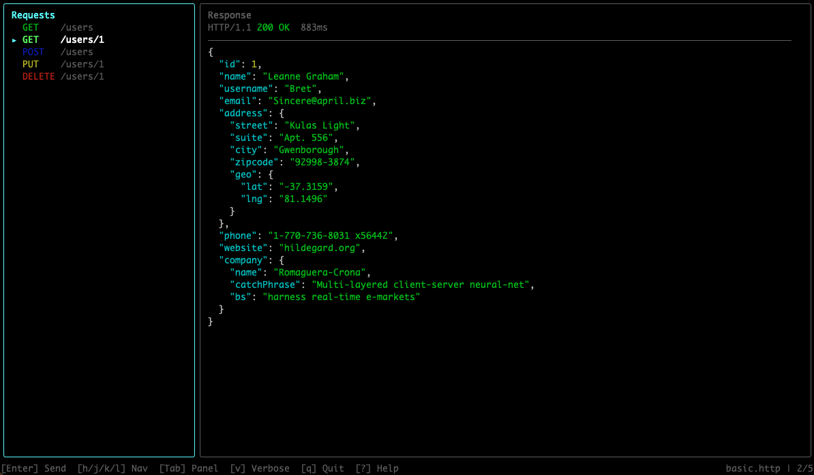
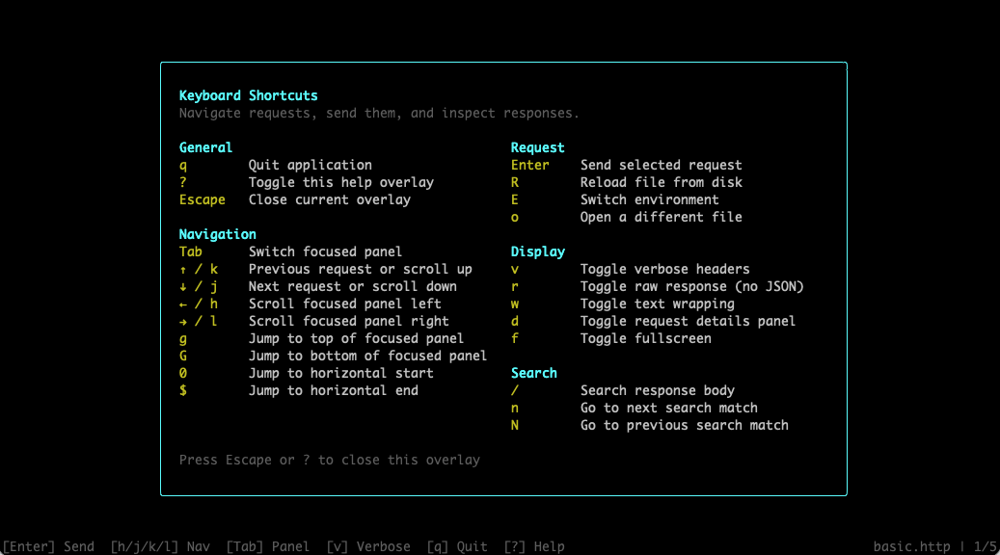

# httptui

Interactive terminal UI for .http files.



httptui is a fast, keyboard-driven REST client that lives in your terminal. It parses `.http` and `.rest` files, allowing you to browse and execute requests without leaving your workflow.

## Features

- **Multi-Format Support**: Parse `.http` and `.rest` files, plus import Postman collections (`.json`) with authentication, nested folders, and multiple body types (raw, URL-encoded, form-data).
- **Rich Variable System**: File-level (`@name = value`), system (`{{$timestamp}}`, `{{$guid}}`, `{{$randomInt}}`), process environment (`{{$processEnv}}`), and dotenv (`{{$dotenv}}`) variables. Nested references supported.
- **Environment Management**: Load Postman or simplified environment files via `--env`, pre-register named environments in config, and switch at runtime with an interactive picker (`E`).
- **Keyboard-Driven TUI**: Vim-style navigation, split-panel layout, request details panel (`d`), fullscreen mode (`f`), and on-screen help overlay (`?`).
- **Response Inspection**: Colorized status codes, pretty-printed JSON with raw toggle (`r`), verbose headers (`v`), text wrapping (`w`), and search with match highlighting (`/`).
- **mTLS & Client Certificates**: Per-host client certificates (PEM/PFX) via global or project-level config, with wildcard matching and passphrase support.
- **Export as .http**: Save any request list (including Postman imports) to `.http` format with variables preserved (`S`).
- **Fast & Lightweight**: Built with Ink, React, and undici. Request timing, body size metrics, 30-second timeout.



## Requirements

- **Node.js 24 or newer.** httptui declares `engines.node: ">=24"`; installing on older Node versions will trigger an `EBADENGINE` warning from npm and is not supported.

## Installation

```bash
npm install -g httptui
```

Or

```bash
# npm config get prefix
# npm config set prefix "$HOME/.local"
# npm config delete prefix

cd <project-folder>
npm install
npm run build
npm link

# npm unlink httptui
```

## Usage

```bash
httptui path/to/api.http
```

You can also open a different `.http` file from within the running TUI by pressing `o` and typing the file path. This is useful when working across multiple API definition files without restarting httptui.

### Options

| Flag | Description |
|------|-------------|
| `--insecure`, `-k` | Skip TLS certificate verification |
| `--env`, `-e` | Load an environment file (Postman or simplified format) |
| `--env-name`, `-E` | Select an environment by name from the config file |

```bash
# Skip TLS certificate verification
httptui --insecure path/to/api.http
httptui -k path/to/api.http

# Load an environment file by path
httptui collection.json --env dev.postman_environment.json
httptui api.http -e staging.json

# Select an environment by name from config
httptui api.http --env-name Development
httptui api.http -E Staging
```

## Keyboard Shortcuts

### Navigation

| Key | Action |
|-----|--------|
| `↑` / `k` | Previous request / Scroll up |
| `↓` / `j` | Next request / Scroll down |
| `←` / `h` | Scroll focused panel left |
| `→` / `l` | Scroll focused panel right |
| `g` | Jump to top of focused panel |
| `G` | Jump to bottom of focused panel |
| `0` | Jump to horizontal start |
| `$` | Jump to horizontal end |
| `Tab` | Switch focus between panels |

### Request

| Key | Action |
|-----|--------|
| `Enter` | Send selected request |
| `R` | Reload file from disk |
| `o` | Open a different .http file |
| `E` | Switch environment |
| `S` | Save as .http file |

### Display

| Key | Action |
|-----|--------|
| `v` | Toggle verbose mode (show/hide headers) |
| `r` | Toggle raw mode (no JSON formatting) |
| `w` | Toggle text wrapping |
| `d` | Toggle request details panel |
| `f` | Toggle fullscreen |

### Search

| Key | Action |
|-----|--------|
| `/` | Search response body |
| `n` | Go to next match |
| `N` | Go to previous match |

### General

| Key | Action |
|-----|--------|
| `?` | Toggle help overlay |
| `Escape` | Close current overlay / Exit fullscreen |
| `q` | Quit application |

## .http File Format

httptui supports a subset of the standard `.http` format used by VS Code REST Client.

### Request Separation
Use `###` to separate multiple requests in a single file. You can add an optional name after the separator.

```http
### Get all users
GET https://api.example.com/users
```

### Headers and Body
Headers follow the request line. A blank line separates headers from the request body.

```http
POST https://api.example.com/users
Content-Type: application/json

{
  "name": "John Doe"
}
```

### Variables

#### File Variables
Define variables at the top of your file using `@name = value`. Reference them with `{{name}}`.

```http
@hostname = api.example.com
GET https://{{hostname}}/users
```

#### System Variables
- `{{$timestamp}}`: Current Unix timestamp.
- `{{$guid}}`: Random UUID v4.
- `{{$randomInt min max}}`: Random integer between min and max.

#### Environment Variables
- `{{$processEnv VAR_NAME}}`: Read from your shell environment.
- `{{$dotenv VAR_NAME}}`: Read from a `.env` file in the `.http` file's directory first, then fall back to the current working directory.

#### Environment Files
Load environment files with the `--env` / `-e` flag. httptui supports both Postman environment files (`.postman_environment.json`) and a simplified format. Environment variables override file-level and collection-level variables of the same name. This works for both `.http` files and Postman collections.

```bash
httptui collection.json --env dev.postman_environment.json
httptui api.http -e staging.json
```

**Simplified format** (compatible with Postman, but without Postman-specific metadata):

```json
{
  "name": "Development",
  "values": [
    { "key": "baseUrl", "value": "https://api.dev.com", "enabled": true },
    { "key": "apiKey", "value": "dev-secret-key", "enabled": true }
  ]
}
```

The `enabled` field is optional and defaults to `true`. Disabled variables are skipped. The `type` field is ignored (no secret masking).

## Examples

Here is a basic example showing common request types:

```http
### Get all users
GET https://jsonplaceholder.typicode.com/users

### Get user by ID
GET https://jsonplaceholder.typicode.com/users/1

### Create a new user
POST https://jsonplaceholder.typicode.com/users
Content-Type: application/json

{
  "name": "John Doe",
  "username": "johndoe",
  "email": "john@example.com"
}

### Update user
PUT https://jsonplaceholder.typicode.com/users/1
Content-Type: application/json

{
  "name": "Jane Doe",
  "username": "janedoe",
  "email": "jane@example.com"
}

### Delete user
DELETE https://jsonplaceholder.typicode.com/users/1
```

## TLS Troubleshooting

httptui loads system CA certificates by default. This means certificates from your OS certificate store (macOS Keychain, Windows Certificate Store, Linux OpenSSL directories) are trusted automatically — the same behavior as browsers and VS Code REST Client.

When a TLS error occurs, httptui displays a smart hint suggesting the appropriate fix (e.g., `--insecure` or `NODE_EXTRA_CA_CERTS`).

If you need to authenticate with a client certificate, see the [Client Certificates](#client-certificates) section for mTLS configuration.

### Common fixes

#### 1. Point to your CA certificate file

If you have a custom CA certificate not in your OS store (e.g., a self-signed dev cert), use `NODE_EXTRA_CA_CERTS`:

```bash
NODE_EXTRA_CA_CERTS=/path/to/your-ca.pem httptui api.http
```

The file should be PEM-encoded and can contain multiple certificates.

#### 2. Skip certificate verification (not recommended)

As a last resort, disable TLS verification entirely:

```bash
httptui --insecure api.http
httptui -k api.http
```

**Warning**: This disables all certificate checks, making connections vulnerable to man-in-the-middle attacks. Use only for local development or trusted networks.

### OpenSSL 3.5 restrictions (Node.js 24+)

Node.js 24 ships OpenSSL 3.5 with security level 2 by default. This means:
- **RSA, DSA, and DH keys shorter than 2048 bits are rejected.**
- **RC4 cipher suites are prohibited.**

If you connect to a legacy server with weak certificates, you may see new TLS errors that didn't occur on earlier Node.js versions. The fix is to upgrade the server's certificates to use at least 2048-bit RSA keys.

## Configuration

httptui loads configuration from two sources: a global config file and an optional project-level sidecar file.

### Global Config

- **macOS/Linux**: `~/.config/httptui/config.json`
- **Windows**: `%APPDATA%\httptui\config.json`

Paths starting with `~` expand to your home directory. Relative paths resolve against the global config directory.

You can override the global config location using the `HTTP_TUI_CONFIG` environment variable:

```bash
HTTP_TUI_CONFIG=/path/to/custom-config.json httptui api.http
```

### Project-Level Config

You can also place a `.httptui.json` file in the same directory as your `.http` file. This is useful for sharing request collections in teams or keeping project-specific certificates alongside your code.

#### Precedence

Project config values override global config values for all top-level keys. For example, if both files define `certificates`, the project's `certificates` completely replace the global ones for that session.

#### Relative Path Resolution

- **Global config**: Relative paths resolve against the global config directory (`~/.config/httptui/`).
- **Project config**: Relative paths resolve against the directory containing the `.httptui.json` file.

## Environment Configuration

You can register environment files in your global or project-level config file and reference them by name using the `--env-name` / `-E` flag.

```json
{
  "environments": [
    { "name": "Development", "file": "env/dev.json" },
    { "name": "Staging", "file": "env/staging.json" }
  ]
}
```

Relative paths are resolved against the config directory. If both global and project configs define `environments`, the project config replaces the global one entirely.

### Runtime Environment Switcher

Press `E` while the TUI is running to open the environment picker.

- The picker lists all environments registered in your configuration files.
- If you launched httptui with the `--env` flag, that file's name (or basename) is also included in the list.
- Use `↑`/`↓` or `j`/`k` to navigate the list. Press `g` to jump to the top or `G` to jump to the bottom.
- The picker shows at most 8 options at a time (including `(none)`); the list scrolls automatically as you move the highlight. On short terminals, fewer rows are shown to fit the screen.
- Press `Enter` to apply the selected environment or `Esc` to cancel.
- Selecting the `(none)` option reverts to using only file-level variables.
- The active environment name is displayed in the status bar.

## Saving as .http

After opening a Postman collection (or any file), press `S` to save all requests as a `.http` file. A save overlay appears with a default path — `<collection-basename>.http` in the same directory as the loaded file. You can type a new path (absolute or relative to the loaded file's directory) and press `Enter` to save, or `Escape` to cancel.

If the target file already exists, a ` - N` suffix is automatically appended (e.g., `api - 1.http`) without confirmation.

The saved `.http` file contains all requests with their names, methods, URLs, headers, and bodies. File-level variables are preserved as `@name = value` declarations, and `{{variable}}` placeholders are kept intact for round-trippability.

**Limitations**: Multipart form-data bodies (text fields) are omitted with an inline comment, as the `.http` format has no multipart syntax. GraphQL bodies, file uploads, and Postman scripts are already dropped during import and cannot be recovered. Postman folder structure is preserved as request names (e.g., `### Users / Create User`).

## Client Certificates

Configure SSL client certificates for mTLS endpoints in either the global config file or a project-level `.httptui.json` file.

```json
{
  "certificates": {
    "api.internal:8443": {
      "cert": "~/certs/client.pem",
      "key": "~/certs/client.key"
    },
    "legacy.internal": {
      "pfx": "./certs/legacy.p12",
      "passphrase": "$LEGACY_PFX_PASSWORD"
    },
    "*.staging.internal": {
      "cert": "/etc/ssl/staging.crt",
      "key": "/etc/ssl/staging.key"
    },
    "vault.internal": {
      "ca": "./certs/vault-ca.pem"
    }
  }
}
```

### Details

- **Passphrases**: Prefix the value with `$` to reference an environment variable (e.g., `"$MY_PWD"`). Plaintext passphrases are supported but discouraged.
- **CA-only**: Use the `ca` field to trust a specific server without providing client credentials.
- **Matching Priority**: Exact host:port > exact host > wildcard.
- **Protocol**: Client certificates only apply to HTTPS requests. HTTP requests ignore this configuration.
- **Absolute Paths**: Paths starting with `/` are used as-is.

### Project-Level Example

With a `.httptui.json` at `/project/api/.httptui.json`, the relative path `./certs/client.crt` resolves to `/project/api/certs/client.crt`.

```json
{
  "certificates": {
    "api.corp.local": {
      "cert": "./certs/client.crt",
      "key": "./certs/client.key"
    }
  }
}
```

## Environment Variables

- `{{$processEnv VAR_NAME}}`: Read from your shell environment.
- `{{$dotenv VAR_NAME}}`: Read from a `.env` file in the `.http` file's directory first, then fall back to the current working directory.

## Tech Stack

- **TypeScript**: Type-safe development.
- **Ink**: React-based framework for building interactive CLIs.
- **React**: Component-based UI architecture.
- **undici**: Modern, high-performance HTTP client for Node.js.
