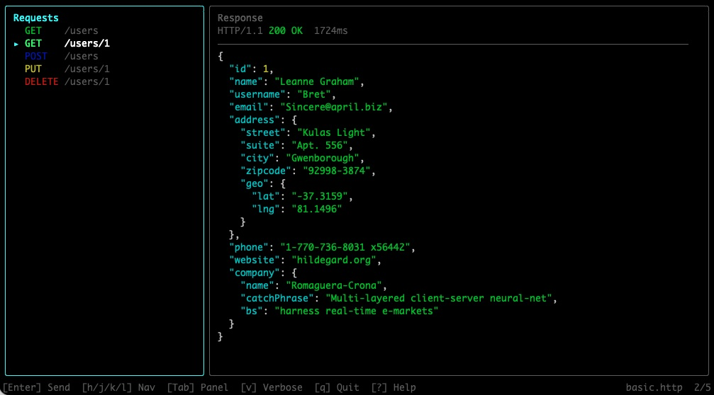

# httptui

Interactive terminal UI for .http files.



httptui is a fast, keyboard-driven REST client that lives in your terminal. It parses `.http` and `.rest` files, allowing you to browse and execute requests without leaving your workflow.

## Features

- **Interactive TUI**: Split-panel layout with request list and response viewer.
- **Keyboard First**: Navigate, send requests, and toggle views entirely with shortcuts.
- **Variable Support**: Use file-level, system, and environment variables.
- **Response Inspection**: Colorized status codes, headers, and pretty-printed JSON.
- **Fast**: Built with Ink and undici for a lightweight, responsive experience.


## Requirements

- **Node.js 24 or newer.** httptui declares `engines.node: ">=24"`; installing on older Node versions will trigger an `EBADENGINE` warning from npm and is not supported.

## Installation

```bash
npm install -g httptui
```

Or

```bash
# npm config get prefix
# npm config set prefix "$HOME/.local"
# npm config delete prefix

cd <project-folder>
npm install
npm run build
npm link

# npm unlink httptui
```

## Usage

```bash
httptui path/to/api.http
```

You can also open a different `.http` file from within the running TUI by pressing `o` and typing the file path. This is useful when working across multiple API definition files without restarting httptui.

### Options

| Flag | Description |
|------|-------------|
| `--insecure`, `-k` | Skip TLS certificate verification |

```bash
# Skip TLS certificate verification
httptui --insecure path/to/api.http
httptui -k path/to/api.http
```

## Keyboard Shortcuts

| Key | Action |
|-----|--------|
| `↑` / `k` | Select previous request / Scroll response up |
| `↓` / `j` | Select next request / Scroll response down |
| `←` / `h` | Scroll focused panel left |
| `→` / `l` | Scroll focused panel right |
| `g` | Jump to top of focused panel |
| `G` | Jump to bottom of focused panel |
| `0` | Jump to horizontal start of focused panel |
| `$` | Jump to horizontal end of focused panel |
| `Enter` | Send currently selected request |
| `Tab` | Switch focus between panels |
| `v` | Toggle verbose mode (show/hide headers) |
| `r` | Toggle raw mode (no JSON formatting) |
| `w` | Toggle text wrapping in response panel |
| `d` | Toggle request details panel |
| `o` | Open a different .http file |
| `R` | Reload file from disk |
| `/` | Search response body |
| `n` | Go to next search match |
| `N` | Go to previous search match |
| `Escape` | Close current overlay |
| `?` | Toggle help overlay |
| `q` | Quit application |

## .http File Format

httptui supports a subset of the standard `.http` format used by VS Code REST Client.

### Request Separation
Use `###` to separate multiple requests in a single file. You can add an optional name after the separator.

```http
### Get all users
GET https://api.example.com/users
```

### Headers and Body
Headers follow the request line. A blank line separates headers from the request body.

```http
POST https://api.example.com/users
Content-Type: application/json

{
  "name": "John Doe"
}
```

### Variables

#### File Variables
Define variables at the top of your file using `@name = value`. Reference them with `{{name}}`.

```http
@hostname = api.example.com
GET https://{{hostname}}/users
```

#### System Variables
- `{{$timestamp}}`: Current Unix timestamp.
- `{{$guid}}`: Random UUID v4.
- `{{$randomInt min max}}`: Random integer between min and max.

#### Environment Variables
- `{{$processEnv VAR_NAME}}`: Read from your shell environment.
- `{{$dotenv VAR_NAME}}`: Read from a `.env` file in the current directory.

## Examples

Here is a basic example showing common request types:

```http
### Get all users
GET https://jsonplaceholder.typicode.com/users

### Get user by ID
GET https://jsonplaceholder.typicode.com/users/1

### Create a new user
POST https://jsonplaceholder.typicode.com/users
Content-Type: application/json

{
  "name": "John Doe",
  "username": "johndoe",
  "email": "john@example.com"
}

### Update user
PUT https://jsonplaceholder.typicode.com/users/1
Content-Type: application/json

{
  "name": "Jane Doe",
  "username": "janedoe",
  "email": "jane@example.com"
}

### Delete user
DELETE https://jsonplaceholder.typicode.com/users/1
```

## TLS Troubleshooting

httptui loads system CA certificates by default. This means certificates from your OS certificate store (macOS Keychain, Windows Certificate Store, Linux OpenSSL directories) are trusted automatically — the same behavior as browsers and VS Code REST Client.

If you still encounter certificate errors like `UNABLE_TO_VERIFY_LEAF_SIGNATURE` or `SELF_SIGNED_CERT_IN_CHAIN`, try these solutions:

### 1. Point to your CA certificate file

If you have a custom CA certificate not in your OS store (e.g., a self-signed dev cert), use `NODE_EXTRA_CA_CERTS`:

```bash
NODE_EXTRA_CA_CERTS=/path/to/your-ca.pem httptui api.http
```

The file should be PEM-encoded and can contain multiple certificates.

### 2. Skip certificate verification (not recommended)

As a last resort, disable TLS verification entirely:

```bash
httptui --insecure api.http
httptui -k api.http
```

**Warning**: This disables all certificate checks, making connections vulnerable to man-in-the-middle attacks. Use only for local development or trusted networks.

### Disabling system CA loading

If you need to revert to Node.js's default bundled CA list (e.g., for reproducible CI environments), opt out with:

```bash
NODE_USE_SYSTEM_CA=0 httptui api.http
```

### OpenSSL 3.5 restrictions (Node.js 24+)

Node.js 24 ships OpenSSL 3.5 with security level 2 by default. This means:
- **RSA, DSA, and DH keys shorter than 2048 bits are rejected.**
- **RC4 cipher suites are prohibited.**

If you connect to a legacy server with weak certificates, you may see new TLS errors that didn't occur on earlier Node.js versions. The fix is to upgrade the server's certificates to use at least 2048-bit RSA keys.

## Tech Stack

- **TypeScript**: Type-safe development.
- **Ink**: React-based framework for building interactive CLIs.
- **React**: Component-based UI architecture.
- **undici**: Modern, high-performance HTTP client for Node.js.
