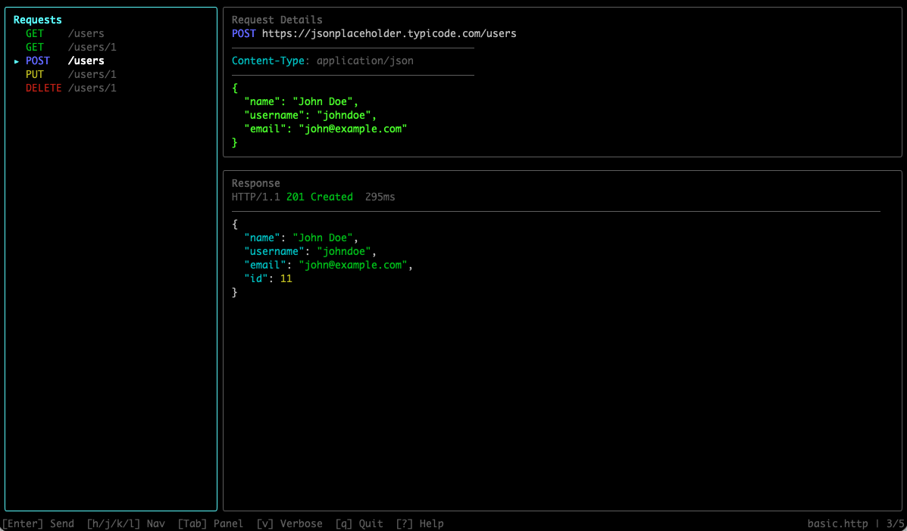
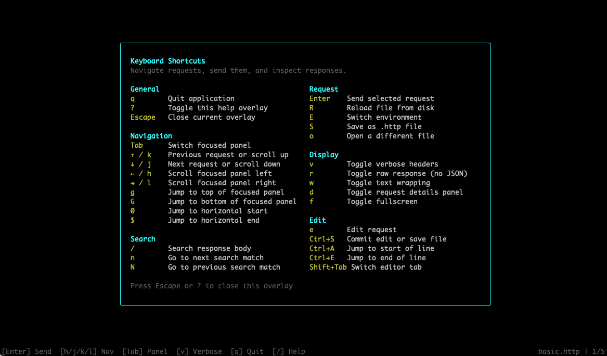

# httptui

[](https://github.com/will8ug/httptui/actions/workflows/ci.yml)


**httptui** is a fast, keyboard-driven REST client that lives in your terminal. It parses `.http` and `.rest` files, allowing you to browse and execute requests without leaving your workflow.



## Features

- **Multi-Format Support**: Parse `.http`, `.rest`, Postman collections, and OpenAPI specs (JSON/YAML).
- **Keyboard-Driven TUI**: Vim keys, split-panel layout, details panel (`d`), fullscreen (`f`), help overlay (`?`).
- **In-Session Editing**: Edit request URLs, headers, and bodies live in the TUI (`e`).
- **Environment Management**: Load environment files, register named environments, switch at runtime (`E`).
- **mTLS & Client Certificates**: Per-host client certificates (PEM/PFX) with wildcard matching.
- **Export as .http**: Save requests to `.http` format with variables preserved (`S`).
- **Copy as curl**: Copy the selected request as a curl command to the clipboard (`y`).



## Requirements

- **Node.js 24 or newer.** httptui declares `engines.node: ">=24"`; installing on older Node versions will trigger an `EBADENGINE` warning from npm and is not supported.

## Installation

```bash
# npm config get prefix
# npm config set prefix "$HOME/.local"
# npm config delete prefix

cd <project-folder>
npm install
npm run build
npm link

# Uninstall from anywhere
# npm unlink @will8ug/httptui
# Or under current project folder:
# npm unlink
```

Or

```bash
npm install -g @will8ug/httptui
```

## Usage

```bash
httptui path/to/api.http
httptui postman-collection.json
httptui openapi.yaml
httptui openapi.json
```

You can also open a different `.http` file from within the running TUI by pressing `o` and typing the file path. This is useful when working across multiple API definition files without restarting httptui.

### Options

| Flag | Description |
|------|-------------|
| `--insecure`, `-k` | Skip TLS certificate verification |
| `--env`, `-e` | Load an environment file (Postman or simplified format) |
| `--env-name`, `-E` | Select an environment by name from the config file |

```bash
# Skip TLS certificate verification
httptui --insecure path/to/api.http
httptui -k path/to/api.http

# Load an environment file by path
httptui collection.json --env dev.postman_environment.json
httptui api.http -e staging.json

# Select an environment by name from config
httptui api.http --env-name Development
httptui api.http -E Staging
```

## Keyboard Shortcuts

### General

| Key | Action |
|-----|--------|
| `?` | Toggle help overlay |
| `Escape` | Close current overlay / Exit fullscreen |
| `q` | Quit application |

### Navigation

| Key | Action |
|-----|--------|
| `↑` / `k` | Previous request / Scroll up |
| `↓` / `j` | Next request / Scroll down |
| `←` / `h` | Scroll focused panel left |
| `→` / `l` | Scroll focused panel right |
| `g` | Jump to top of focused panel |
| `G` | Jump to bottom of focused panel |
| `0` | Jump to horizontal start |
| `$` | Jump to horizontal end |
| `Tab` | Switch focus between panels |

### Request

| Key | Action |
|-----|--------|
| `Enter` | Send selected request |
| `R` | Reload file from disk |
| `o` | Open a different .http file |
| `E` | Switch environment |
| `S` | Export to a new .http file |
| `y` | Copy request as curl |
| `p` | Paste curl to request list |

### Display

| Key | Action |
|-----|--------|
| `v` | Toggle verbose mode (show/hide headers) |
| `r` | Toggle raw mode (no JSON formatting) |
| `w` | Toggle text wrapping |
| `d` | Toggle request details panel |
| `f` | Toggle fullscreen |

### Search

| Key | Action |
|-----|--------|
| `/` | Search response body |
| `n` | Go to next match |
| `N` | Go to previous match |

### Edit

| Key | Action                             |
|-----|------------------------------------|
| `e` | Edit a request in-session          |
| `Shift+Tab` | Switch editor tab |
| `Ctrl+S` | Commit edit or save to source file |
| `Ctrl+A` | Jump to start of line              |
| `Ctrl+E` | Jump to end of line                |
| `Ctrl+G` | Edit requests in external editor (`$EDITOR` or config `editor`) |

## Documentation

- [.http File Format](docs/file-format.md) — Request syntax, headers, and variables.
- [Examples](docs/examples.md) — Common request patterns.
- [Configuration](docs/configuration.md) — Global and project-level config files.
- [Environments](docs/environments.md) — Environment files and the runtime switcher.
- [Client Certificates](docs/certificates.md) — mTLS configuration.
- [Editing](docs/editing.md) — Edit requests in-session or in your `$EDITOR`.
- [Saving as .http](docs/saving.md) — Export requests from any file format.
- [TLS Troubleshooting](docs/tls.md) — Common certificate issues and fixes.

## Tech Stack

- **TypeScript**: Type-safe development.
- **Ink**: React-based framework for building interactive CLIs.
- **React**: Component-based UI architecture.
- **undici**: Modern, high-performance HTTP client for Node.js.
